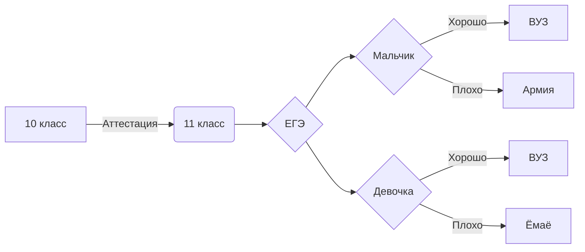

#В этой репозитории говнокод на phyton и не толька

#Егоров Юрий
 
#ссылка на опенпроцессинг - https://editor.p5js.org/uriego544/sketches 
 
#Сайт - https://prostochell-228.github.io/

| Номер задачи ЕГЭ | Статус |
| ------ | ------ |
| 1 | 58 |
| 2 | + |
| 3 | + |
| 4 | 14 |
| 5 |  |
| 6 |  |
| 7 |  |
| 8 |  |
| 9 |  |
| 10 | 45 |
| 11 |  |
| 12 |  |
| 13 | 21 |
| 14 |  |
| 15 |  |
| 16 |  |
| 17 |  |
| 18 |  |
| 19 | 64 |
| 20 | 63/32 |
| 21 | 62 |

__________________________________________

1) Код/ГовноКод/SU-7(base) - база данных в пайтоне с выбором запроса.
2) Код/ГовноКод/from10, to10, - 3 программы связанные с системами счисления: Перевод в десятичную и из десятичной.
3) Код/ГовноКод/Morze - Перевод в азбуку морза.
4) Код/Офис - Все работы по экселю.
5) Код/Графика/всё что не IGЭЭЭ - домашнее задание по библиотеке с черепахой в пайтоне.
6) Код/Графика/IGЭЭЭ - Задание ЕГЭ выполненное библиотекой с черепахой в пайтоне.
7) Код/ГовноКод/ - Все знания на Python.
8) Код/ГовноКод/TabelX.py - Две таблицы умножения.
9) Ige - Я вообще без понятия что это.
10) Код/ГовноКод/Nsim.png - Неронка квадратное уравнение
11) Untitled0.ipynb - Код Хемминга в Google Colab.
12) Sql -  тренировка по сикуэлю
13) Код/Графика/Gordon_Freeman_in_HEV_in_Sybiria_ и Gordon_Freeman_in_Tomsk картинка по запросу
14) Код/Графика/Avatar_pilot своя аватарка 
15) Код/Графика/HatsuneMiku+Doktor соединение двух картинок

[Vetka.pdf](https://github.com/Prostochell-228/UltraloxIT/files/10252178/Vetka.pdf)
[smile.pdf](https://github.com/Prostochell-228/UltraloxIT/files/10251846/smile.pdf)

Логическая формула:
$$A\leftrightarrow B = ({\overline{A}}\vee B) \wedge  ({\overline{B}}\vee A)$$

Первая космическая скорость:
$$v=\sqrt{\frac{GM}{R}}$$

Уравнение Щрёдингера:
$$i\bar{h}\frac{\delta}{\delta t}\Psi=\hat{H}(p,q)\Psi$$

Получение этилового спирта:
$$\mathrm{H_2C\=\ CH_2}+H_2О\xrightarrow{H_2SO_4}H_3C-CH_2-OH$$

