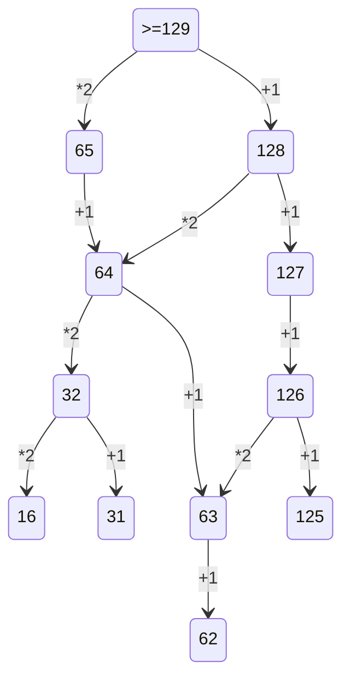

2. 1) Сгенерировать всевозможные сочетания переменных

   2) Проверить логическкую функцию на условие
   
   3) Сопоставить вывод с таблицей из задания

    print('x y z w')
    
    for x in range(2):
    
       for y in range(2):
       
          for z in range(2):
          
             for w in range(2):
             
                if (not(y<=x) or (z<=w) or not(z))==False:
                
                   print(x, y, z, w)
3. На все таблицы поставить фильтр
             
4. 1) Построить двоичное дерево дерево с известными данными
   
   2) Определить количество нужных для кодировки символов 
   
   3) Начать кодировку с минимальной длины кода. Посмотреть, хватает ли оставшийся вариантов, что закодировать остальное символы
   
   4) Если не хватает вариантов для кодирования оставшихся символов - увеличиваем длину кода
   
   
5. 1) Организовать цикл перебора с нуля до чила в условии ответа

   2) Перевод в двоичную СС (через bin() или f'{N:b}')
   
   3) Проверяем по условию и проводим манипуляции с числом
   
   4) Переводим в десятичную и проверяем на условия
    
   ```python  
    chislo=''
    num=(bin(i)[2:])   
    if num.count('1')%2==0:
        chislo='10'+num[2:]+'0'
    if num.count('1')%2!=0:    
        chislo='11'+num[2:]+'1'        
    if int(chislo,2)>40:    
        print (i, int(chislo,2))        
        break
    ```

6. 1) вспомнить команды turtle

   2) Нарисовать по алгоритму
   
   3) Поднять перо и нарисовать точки с учётом масштаба
   
   4) Посчитать вручную
   
8. 1)сгенерировать все возможные варианты чисел(for/product)

   2)проверить строчку на условия
   
   3)выводим счетчик значений
   
10. Открываем расширенный поиск в ворде и ставим галочки у позиций: учитывать регист и всё слово целиком
   
12.Заменяем числа

 ```python  
    H = "8" * 86
    while "8888" in H or "1111" in H:
        if "1111" in H:
            H = H.replace("1111", "8", 1)
        if "8888" in H:
            H = H.replace("8888", "11", 1)
    print(H)
```


13. Накопительно нумеруем вершины графа, потом суммируем или умножаем полученные значения 


14. это алфавит дааааааааааааааааааа
```python  
a='0123456789abcd'

for x in a:
    f=int(f'123{x}5',15)+int(f'1{x}233',15)
    if f%14==0:
        print(f//14)
        break
```


19, 20, 21 - 1) Определить точку входа (условие выигрыша, то сколько очков нужно набрать)

             2) Расписать двоичное дерево на четыре хода
             
             3) Ответить на вопрос задачи, присвоив ход игроку
             
             4) Расписывая таблицу на четыре хода, получаем решение всех трёх задач



23) 1.С помощью product создаём объект со всеми комбинациявми строки.

    2.Перебор программ в совокупности программ.
   
    3.Возврашаем стартовое значение в начальный вид.
    
    4.Используем continue для пропуска итераций неподходящих программ это убыстряет программу

    5.Заходим в программу и творим бесцинства(аннализируем команды)


 ```python  
    def f(x,y):
    if x>y or x==17:
         return 0
    elif x==y:
         return 1
    return(f(x+1,y))+f(x2,y)
print(f(1,10)f(10,35))
```

27) Кольцевая дорога и пункты

      A:Если пунктов мала используем перебор
         
         1.Загружаем файл
         
         2.Избавляемся от первого списка
         
         3.Создаём переменную с длинной списка
         
         4.Сдваиваем список
         
         5.С помошью срезов, изменяем список так чтобы рабочий километр стояьл в 0е
         
         6.Создавая новый список обнуляем стоимость
         
         7.Считаем по формуле сумму для данного километра
         
         8.Создаём переменную для счёта второй  половины пути
         
         9.Считаем стоимость накоплением
         
         10.Найденые суммы на КМ добавляем в список
         
         11.Выводем индекс макс+1
         
      
     B:Если пунктов много импользуем итераций (приближения), с каждым шагом приближаемся к точному ответу
         
         1. так же сдвоенный список
      
         2. вся программа находится в бесконечном цикле, выход из которого - точное решение (точное решение - два раза повторяющийся ответ при шаге 1)
      
         3. большой цикл перебора организован с учётом 3 переменных: старта, финиша и шага
      
         4. шаг настраивается таким образом, чтобы было 20 равнораспределённых замеров по всей дороге
      
         5. после каждого прохода большого цикла старт, финиш и шаг пересчитываются (определяем минимальную стоимость и км, которому она принадлежит) 
      
         6. значения старта и финиша - это границы диапазона поиска
      
         7. новое значение границ диапазона поиска это км минимальной стоимости + шаг и км - шаг
      
         8. после перерасчёта старта и финиша перерасчитываемся шаг (целая часть от деления на 10)
      
         9. когда шаг становится == 0, мы присваиваем ему значение 1
